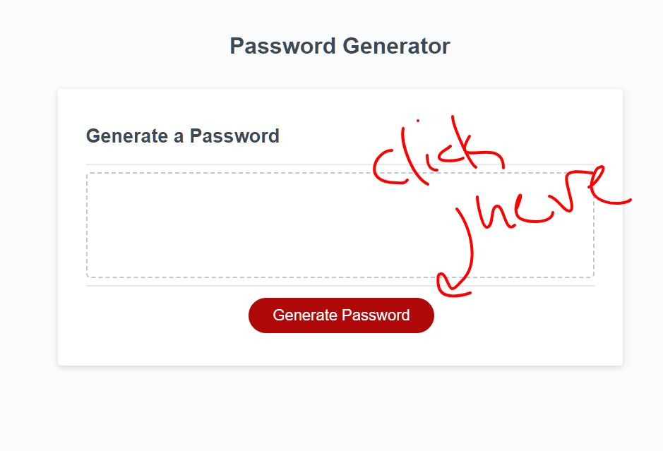
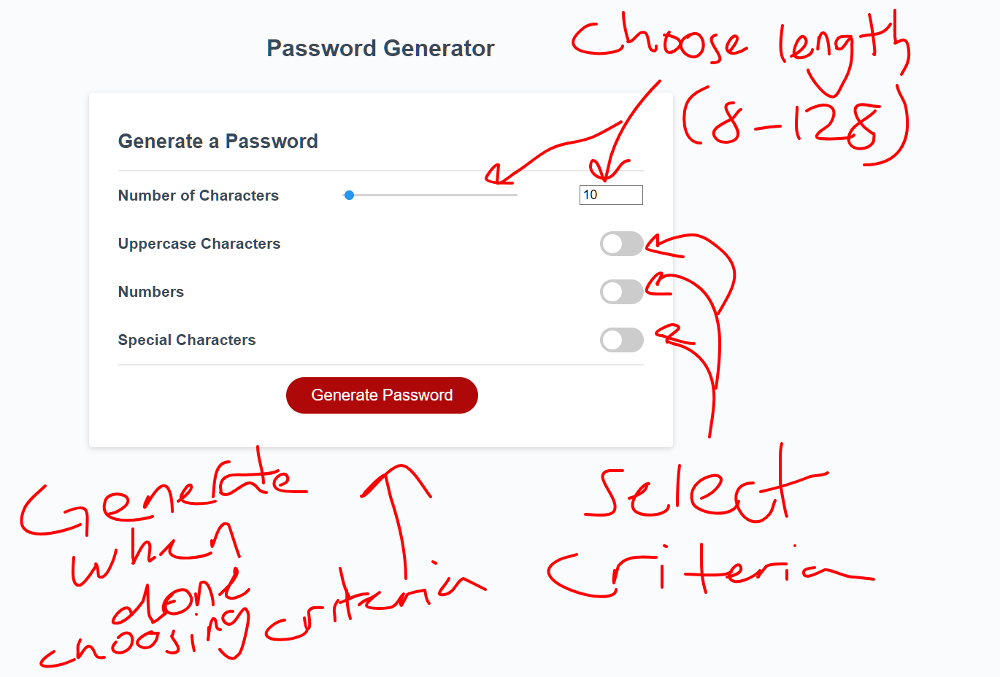
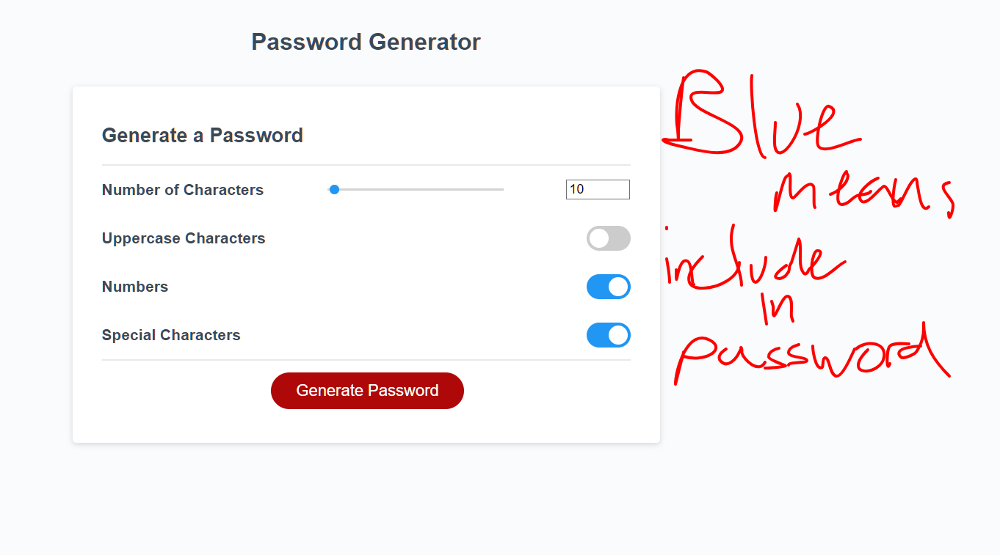
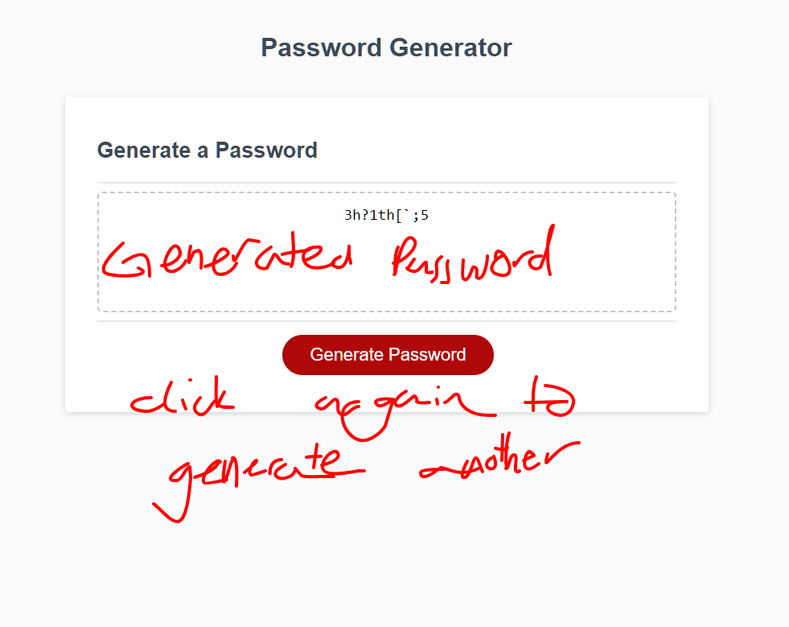

# Password Generator

## Description

This application serves as a place to generate a password based on certain criteria that you can choose; password length, whether there are numbers, wether there are capitals, and wether there are symbols are all the criteria so far.

## Table of Contents (Optional)

If your README is long, add a table of contents to make it easy for users to find what they need.

- [Installation](#installation)
- [Usage](#usage)
- [Credits](#credits)
- [License](#license)

## Usage

Clicking the generate password button will take you to a form where you can set the criteria for the password

The length slider represents a range from 8-128. The range is arbitrary, but manually changing it to more than 128 or less than 8 will result in a warning/alert. All three toggles are fully optional. By default, the password generated will be 10 characters long in all lowercase.

Switches that are "checked" (they are technically checkboxes) are blue, and the associated criteria will appear in the generated password

Clicking generate password brings you back to the initial page, accept this time the generated password is stored there. Passwords are stored in localstorage and thus are saved even if you refresh the page. You can generate another password simply by pressing generate again. Should you generate again, the variable that represents the password is reassigned, and so is lost. (the variable is stored as a JSON object in local storage)

## License

Copyright 2022, Gavin Frazier

Permission is hereby granted, free of charge, to any person obtaining a copy of this software and associated documentation files (the “Software”), to deal in the Software without restriction, including without limitation the rights to use, copy, modify, merge, publish, distribute, sublicense, and/or sell copies of the Software, and to permit persons to whom the Software is furnished to do so, subject to the following conditions:

The above copyright notice and this permission notice shall be included in all copies or substantial portions of the Software.

THE SOFTWARE IS PROVIDED “AS IS”, WITHOUT WARRANTY OF ANY KIND, EXPRESS OR IMPLIED, INCLUDING BUT NOT LIMITED TO THE WARRANTIES OF MERCHANTABILITY, FITNESS FOR A PARTICULAR PURPOSE AND NONINFRINGEMENT. IN NO EVENT SHALL THE AUTHORS OR COPYRIGHT HOLDERS BE LIABLE FOR ANY CLAIM, DAMAGES OR OTHER LIABILITY, WHETHER IN AN ACTION OF CONTRACT, TORT OR OTHERWISE, ARISING FROM, OUT OF OR IN CONNECTION WITH THE SOFTWARE OR THE USE OR OTHER DEALINGS IN THE SOFTWARE.